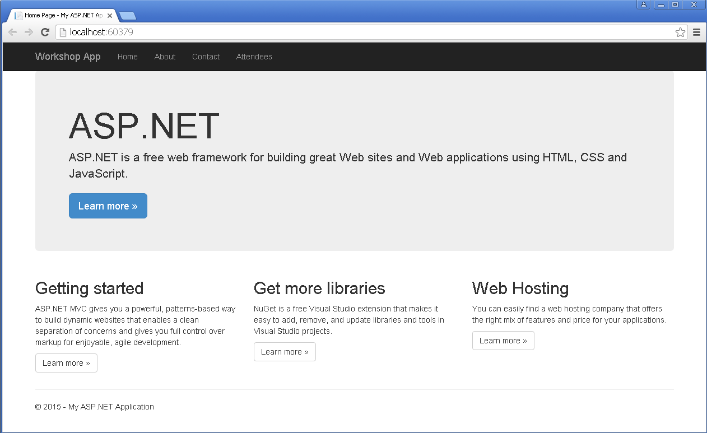
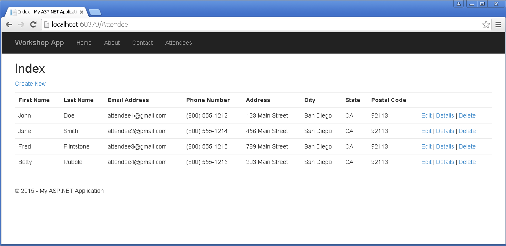

= Lab 7 - Binding to a Database

[abstract]
--
In this lab we will continue adding on to our Attendees ASP.NET application by using a MySQL database
--

= Lab - Binding to Services

== Building upon our Attendees Application

=== Data Model, Initialization and Connection Details

. Right click on the Project name and select Manage NuGet Packages
. Click the browse link 
. Search for mysql
. Select the MySql.Data.Entity by Oracle (v6.9.8) and click the Install Button. 
.. Click to accept the Changes
.. Click to accept the License
.. Close the readme.txt and NuGet tabs
. Navigate to the Models folder
. Create an Attendee.cs Class
.. Use the following code in this file. Be sure to pay attention to the namespace 
```C#
using System;
using System.Collections.Generic;
using System.ComponentModel.DataAnnotations;
using System.Linq;
using System.Web;

namespace MVCAttendees.Models
{
    public class Attendee
    {
        [Display(Name = "Attendee ID")]
        [Key]
        public int id { get; set; }

        [Display(Name = "First Name")]
        [StringLength(60)]
        public string firstName { get; set; }

        [Display(Name = "Last Name")]
        [StringLength(60)]
        public string lastName { get; set;  }

        [Display(Name = "Name")]
        public string name { get { return firstName + " " + lastName; } }

        [Display(Name = "Email Address")]
        [StringLength(255)]
        public string email { get; set; }

        [Display(Name = "Phone Number")]
        [StringLength(20)]
        public string phoneNumber { get; set; }

        [Display(Name = "Address")]
        [StringLength(60)]
        public string address { get; set; }

        [Display(Name = "City")]
        [StringLength(60)]
        public string city { get; set; }

        [Display(Name = "State")]
        [StringLength(40)]
        public string state { get; set; }

        [Display(Name = "Postal Code")]
        [StringLength(10)]
        public string zipCode { get; set; }
    }
}
```
. Add "using System.ComponentModel.DataAnnotations;" to the using section of the class
. Save the Attendee Model class.
. Create a DAL folder in the project. 
. Create an AtttendeeContext.cs Class file in the DAL folder created above
.. Use the following code in this file. Be sure to pay attention to the namespace 
```C#
using System;
using System.Collections.Generic;
using System.Linq;
using System.Web;
using System.Data.Entity;
using System.Data.Entity.ModelConfiguration.Conventions;
using MVCAttendees.Models;

namespace MVCAttendees.DAL
{
    [DbConfigurationType(typeof(MySql.Data.Entity.MySqlEFConfiguration))]
    public class AttendeeContext : DbContext
    {
        public DbSet<Attendee> Attendees { get; set; }

        protected override void OnModelCreating(DbModelBuilder modelBuilder)
        {
            modelBuilder.Conventions.Remove<PluralizingTableNameConvention>();

            modelBuilder.Entity<Attendee>();
        }
    }
}
```
. Add the following to the using section
```C#
using System.Data.Entity;
using System.Data.Entity.ModelConfiguration.Conventions;
using MVCAttendees.Models;
```
. Save the AtttendeeContext.cs file
. Create an AttendeeInitializer.cs Class file in the DAL folder
.. Use the following code in this file. Be sure to pay attention to the namespace
```C#
using System;
using System.Collections.Generic;
using System.Linq;
using System.Web;
using MVCAttendees.Models;

namespace MVCAttendees.DAL
{
    public class AttendeeInitializer : System.Data.Entity.DropCreateDatabaseAlways<AttendeeContext>
    {
        protected override void Seed(AttendeeContext context)
        {
            List<Attendee> attendees = new List<Attendee>
            {
            new Attendee{id=1,address="123 Main Street",city="San Diego",email="attendee1@gmail.com",firstName="John",lastName="Doe",phoneNumber="(800) 555-1212",state="CA",zipCode="92113"},
            new Attendee{id=2,address="456 Main Street",city="San Diego",email="attendee2@gmail.com",firstName="Jane",lastName="Smith",phoneNumber="(800) 555-1214",state="CA",zipCode="92113"},
            new Attendee{id=3,address="789 Main Street",city="San Diego",email="attendee3@gmail.com",firstName="Fred",lastName="Flintstone",phoneNumber="(800) 555-1215",state="CA",zipCode="92113"},
            new Attendee{id=4,address="203 Main Street",city="San Diego",email="attendee4@gmail.com",firstName="Betty",lastName="Rubble",phoneNumber="(800) 555-1216",state="CA",zipCode="92113"},
            };

            attendees.ForEach(a => context.Attendees.Add(a));
            context.SaveChanges();
       }
    }
}
```
. Add "using MVCAttendees.Models;" to the using section of the class
. Save the AttendeeInitializer.cs file
. Change the Web.Config to point to your local instance of MySQL
.. Open Web.Config
.. Add a connectionString section in the <configuration> node between the <configSections> and <appSettings>. If you changed the database name, user name and/or password, update the appropriate parts in the connection string. 
```XML
  </configSections>
  <connectionStrings>
    <add name="AttendeeContext" connectionString="Server=localhost;Port=3306;Database=pcfdemo;Uid=pcfuser;Pwd=pcfpwd" providerName="MySql.Data.MySqlClient" />
  </connectionStrings>
  <appSettings>
```
. Scroll down in the Web.Config until you hit the <system.web> section
. Add the following node to the <system.web> section
```XML
   <customErrors mode="Off" />
```
. This will enable us to see the error in the browser for troubleshooting purposes. For production apps, this should be removed.
. Scroll down in the Web.Config until you get to the <entityFramework> section
.. Add a contexts section at the beginning of the <entityFramework> section, be sure to pay attention to the namespace
```XML
    <contexts>
      <context type="MVCAttendees.DAL.AttendeeContext, MVCAttendees">
        <databaseInitializer type="MVCAttendees.DAL.AttendeeInitializer, MVCAttendees" />
      </context>
    </contexts>
```
. Save the Web.Config file

=== Updating the User Interface

. Add an AttendeeController to the Controllers folder
. Right Click the Controllers Folder, select Add | Controller...
.. For the Controller name use AttendeeController
.. Use the following code in the controller
```C#
using System;
using System.Collections.Generic;
using System.Data.Entity.Infrastructure;
using System.Linq;
using System.Net;
using System.Web;
using System.Web.Mvc;
using MVCAttendees.DAL;
using MVCAttendees.Models;

namespace MVCAttendees.Controllers
{
    public class AttendeeController : Controller
    {
        private AttendeeContext db = new AttendeeContext();

        // GET: Attendee
        public ViewResult Index()
        {
            Console.WriteLine("Getting ready to read the list of attendees");
            var attendees = from s in db.Attendees
                            select s;
            Console.WriteLine("Returning the list of attendees");
            return View(attendees);
        }
        
        protected override void Dispose(bool disposing)
        {
            db.Dispose();
            base.Dispose(disposing);
        }
    }
}        
```
. Add the following to the using section
```C#
using MVCAttendees.DAL;
using MVCAttendees.Models;
```
. Save the AttendeeController
. Highlight the public ViewResult Index() method
. Right-click and select Add View
.. View Name: Index
.. Template: List
.. Model class: Attendee (MVCAttendees.Models)
.. Data context class: AttendeeContext (MVCAttendees.DAL)
.. Use a layout page: ~/Views/Shared/_Layout.cshtml
. If you run into Visual Studio errors, open the AttendeeContext.cs and comment out the DbConfigurationType attribute and save the file.
```C#
namespace MVCAttendees.DAL
{
   // [DbConfigurationType(typeof(MySql.Data.Entity.MySqlEFConfiguration))]
    public class AttendeeContext : DbContext
    {
        public DbSet<Attendee> Attendees { get; set; }

        protected override void OnModelCreating(DbModelBuilder modelBuilder)
        {
            modelBuilder.Conventions.Remove<PluralizingTableNameConvention>();

            modelBuilder.Entity<Attendee>();
        }
    }
}
```
. Open the _Layout.cshtml file which is located in Views\Shared folder
. Change the "Application name" in the first Html.ActionLink to "Attendees"
.. It should look something like this:
```HTML
		@Html.ActionLink("Workshop App", "Index", "Home", new { area = "" }, new { @class = "navbar-brand" })
```
. Add an Html Action link to the navbar area of the file
.. It should look something like this:
```HTML
            <div class="navbar-collapse collapse">
                <ul class="nav navbar-nav">
                    <li>@Html.ActionLink("Home", "Index", "Home")</li>
                    <li>@Html.ActionLink("About", "About", "Home")</li>
                    <li>@Html.ActionLink("Contact", "Contact", "Home")</li>
                    <li>@Html.ActionLink("Attendees", "Index", "Attendee")</li>
                </ul>
            </div>
```
. Save the file and run the project. You should the following screen

. Click on the Attendees link and you should see the following screen


=== Running on Pivotal Cloud Foundry


== Target

. If you haven't already, download the latest release of the Cloud Foundry command line interface  (CLI) from https://github.com/cloudfoundry/cli/releases for your operating system and install it.

. Set the API target for the CLI: (set appropriate end point for your environment)
+
----
> cf api https://api.pcf1.cloud.fe.pivotal.io --skip-ssl-validation
----

. Login to Pivotal Cloudfoundry:
+
----
> cf login
----
+
Follow the prompts.  You should have a welcome card with your username and password on it.  If you didn't get one, please ask.

== Create a New ASP.NET Web Application 

. Open Visual Studio and create a new ASP.NET Web Application with the name MVCAttendees
.. Choose MVC as the Template
.. Change the Authentication to No Authentication
. Run it locally to verify that the application works locally

== Publish the Application

. Right click on the project name and select Publish...
. Choose a Custom publish target. 
.. Provide a name like Publish for PCF - Debug
.. Publish method: File System
.. Target location ..\PCFDeploy
.. Choose a configuration (Debug or Release)
.. (Optional) Change File Publish Options
... Check Delete all existing files prior to publish
... Check Precompile during publishing
. Create a PCF Manifest file
.. Create a manfest.yml file in the Publish Target Location
.. Change the section <your initials> to use your own initials
```
---
applications:
- name: wsattendees
  host: wsattendees-<your initials>
  memory: 512m
  stack: windows2012R2
  buildpack: binary_buildpack
```

== Push It!

. Open up a command prompt 
. Change to the _Publish Target Location_  directory (this is the folder containing the published code files and manifest.yml):
+
----
> cd $ProjectHome/PCFDeploy
----

. Push the application!
+
----
> cf push
----
+
You should see output similar to the following listing. Take a look at the listing callouts for a play-by-play of what's happening:
+
====
----
C:\...\MVCAttendees\PCFDeploy>cf push
Using manifest file C:\Users\Rick Ross\Documents\Visual Studio 2015\Projects\MVCAttendees\PCFDeploy\manifest.yml

Using stack windows2012R2...
OK
Creating app wsattendees in org instructor / space development as instructor...
OK

Creating route wsattendees-rr.pcf1.cloud.fe.pivotal.io...
OK

Binding wsattendees-rr.pcf1.cloud.fe.pivotal.io to wsattendees...
OK

Uploading wsattendees...
Uploading app files from: C:\Users\Rick Ross\Documents\Visual Studio 2015\Projects\MVCAttendees\PCFDeploy
Uploading 1.1M, 47 files
Done uploading
OK

Starting app wsattendees in org instructor / space development as instructor...
Creating container
Successfully created container
Downloading app package...
Downloaded app package (5.8M)
Downloading buildpacks (binary_buildpack)...
Downloading binary_buildpack...
Downloaded binary_buildpack
Downloaded buildpacks
Staging...
Exit status 0
Staging complete
Uploading droplet, build artifacts cache...
Uploading build artifacts cache...
Uploading droplet...
Uploaded droplet (5.8M)
Uploading complete

0 of 1 instances running, 1 starting
0 of 1 instances running, 1 starting
1 of 1 instances running

App started


OK

App wsattendees was started using this command `..\tmp\lifecycle\WebAppServer.exe`

Showing health and status for app wsattendees in org instructor / space development as instructor...
OK

requested state: started
instances: 1/1
usage: 512M x 1 instances
urls: wsattendees-rr.pcf1.cloud.fe.pivotal.io
last uploaded: Tue Dec 8 19:02:37 UTC 2015
stack: windows2012R2
buildpack: binary_buildpack

     state     since                    cpu    memory      disk      details
#0   running   2015-12-08 02:03:31 PM   0.0%   0 of 512M   0 of 1G

$
----
<1> The CLI is using a manifest to provide necessary configuration details such as application name, memory to be allocated, the stack to be used (in this case Windows2012R2), the number of instances requested to start, and path to the application artifact.
Take a look at `manifest.yml` to see how.
<2> In most cases, the CLI indicates each Cloud Foundry API call as it happens.
In this case, the CLI has created an application record for _wsattendees_ in your assigned space.
<3> All HTTP/HTTPS requests to applications will flow through Cloud Foundry's front-end router called http://docs.cloudfoundry.org/concepts/architecture/router.html[(Go)Router].
Here the CLI is creating a route with your initials (again, see `manifest.yml` for a hint!) to prevent route collisions across the default `pcf1.cloud.fe.pivotal.io` domain.
<4> Now the CLI is _binding_ the created route to the application.
Routes can actually be bound to multiple applications to support techniques such as http://www.mattstine.com/2013/07/10/blue-green-deployments-on-cloudfoundry[blue-green deployments].
<5> The CLI finally uploads the application bits to Pivotal Cloud Foundry. Notice that it's uploading _47 files_! This is because Cloud Foundry actually uploads all the files for the deployment for caching purposes.
<6> Now we begin the staging process. By choosing the Windows2012R2 stack a container is created on the runtime to prepare the application to run, a second container is then generated that will host your application...in this case using the WebAppServer process in Windows.  If you would continue on to the other language labs you can push an application on the Linux stack, this step gets replaced with the steps appropriate for the application being run.
<7> The complete package of your application and all of its necessary runtime components is called a _droplet_.
Here the droplet is being uploaded to Pivotal Cloudfoundry's internal blobstore so that it can be easily copied to one or more _http://docs.cloudfoundry.org/concepts/architecture/execution-agent.html[Cells]_ for execution.
<8> The CLI tells you exactly what command and argument set was used to start your application.
<9> Finally the CLI reports the current status of your application's health.
====

. Visit the application in your browser by hitting the route that was generated by the CLI:
+
image::mvcattendeesrunning.png[]

== Interact with App from CF CLI

. Get information about the currently deployed application using CLI apps command:
+
----
> cf apps
----
+
Note the application name for next steps

. Scale the app to 2 instances
+
----
> cf scale wsattendees -i 2
----

. Get information about running instances, memory, CPU, and other statistics using CLI instances command
+
----
> cf app wsattendees
----

. Stop the deployed application using the CLI
+
----
> cf stop wsattendees
----

. Delete the deployed application using the CLI
+
----
> cf delete wsattendees
----
